# HDEMG Analysis Tool 🛑

⚠️ This project is a complete work in progress and should not be used for research until the first official release ⚠️

A Python-based application for High-Density Electromyography (HDEMG) signal analysis with motor unit decomposition, visualization, and editing capabilities.

Original matlab code the application is based off:
https://github.com/simonavrillon/MUedit 

### Quick Start Guide

### Prerequisites

- Python 3.13+
- Pip 25.1+


#### The Easy Way [NO docker]

1. Clone this repository:

   ```bash
   git clone git@github.com:unsw-cse-comp99-3900/capstone-project-25t2-9900-t09a-almond.git
   cd capstone-project-25t2-9900-t09a-almond [TO BE REPLACED]
   ```

2. Ensure Python 3.13 or higher is installed

   ```bash
   python --version
   ```

3. Ensure Pip 25.1 or higher is installed

   ```bash
   pip --version
   ```

4. Create virtual environment

   ```bash
   python -m venv .venv
   ```

5. Activate the virtual environment

   ```bash
   Windows:
   .venv\Scripts\activate
   ```

   ```bash
   Linux/MacOS:
   source myenv/bin/activate
   ```

6. Install requirements

   ```bash
   pip install -r requirements.txt
   ```

7. Run the application:

   ```bash
   cd src
   python main.py
   ```


### Dockerized Application

This application has been dockerized to allow for easy deployment and use on any system with Docker installed, eliminating the need to install dependencies locally. The application runs entirely inside the container and is accessed through your web browser or a VNC client.

### Prerequisites

- [Docker](https://docs.docker.com/get-docker/)
- [Docker Compose](https://docs.docker.com/compose/install/) (optional but recommended)
- A web browser or VNC client

#### Manual Setup

1. Clone this repository:

   ```bash
   git clone git@github.com:unsw-cse-comp99-3900/capstone-project-25t2-9900-t09a-almond.git
   cd capstone-project-25t2-9900-t09a-almond
   ```

2. Create a data directory:

   ```bash
   mkdir -p data
   ```

3. Build and start the Docker container:

   ```bash
   # With Docker Compose (recommended)
   docker-compose up -d
   ```

4. Access the application:
   - **Web Browser**: Navigate to http://localhost:6080/vnc.html and click "Connect"
   - **VNC Client**: Connect to localhost:5900

### Accessing the Application

You have two options to access the application:

1. **Web Browser (Recommended)**:

   - Open http://localhost:6080/vnc.html in your web browser
   - Click the "Connect" button
   - No additional software needed

2. **VNC Client**:
   - Install any VNC client (like [RealVNC Viewer](https://www.realvnc.com/en/connect/download/viewer/))
   - Connect to `localhost:5900`
   - No password is required

### Persisting Data

The Docker setup mounts a `data` directory from your host machine to `/app/data` inside the container. Use this directory to store and access your HDEMG data files.

### Project Structure

```
capstone-project-25t2-9900-t09a-almond/
├── data/                  # Data directory mounted into the container
├── docs/                  # Documentation
├── src/                   # Source code
│   ├── app/               # Main application modules
│   │   ├── DecompositionApp.py
│   │   ├── DownloadConfirmation.py
│   │   ├── ExportConfirm.py
│   │   ├── ExportResults.py
│   │   ├── HDEMGDashboard.py
│   │   ├── ImportDataWindow.py
│   │   └── MUeditManual.py
│   ├── core/              # Core functionality
│   ├── public/            # Static resources
│   ├── ui/                # UI components
│   ├── workers/           # Background worker threads
│   └── main.py            # Main entry point
├── docker-compose.yml     # Docker Compose configuration
├── Dockerfile             # Docker container definition
├── requirements.txt       # Python dependencies
├── run-hdemg.bat          # Windows run script
├── run-hdemg.sh           # Linux/macOS run script
└── supervisord.conf       # Supervisor configuration
```

### Stopping the Application

- **With Docker Compose**:

  ```bash
  docker-compose down
  ```

### Application Features

- Import and analyze HDEMG data
- Decompose EMG signals into motor units
- Edit motor units manually
- Visualize signal patterns
- Export analysis results

### Manual Editing And Shortcut Keys  

| Action | Key | Effect |
|--------|-----|--------|
| Flag unit(s) | — | Mark unreliable trains |
| Remove outliers | **r** | Delete spikes causing extreme ISI |
| Add spikes | **a** | Box-select missed spikes |
| Delete spikes | **d** | Box-select false positives |
| Update filter | **Space** | Re-estimate separation vector (current window) |
| Extend filter | **e** | Slide window (50 % overlap) across recording |
| Lock spikes | **l** | Freeze current spikes before re-evaluation |
| Undo / Redo | **z** / **x** | Unlimited stack |
| Save | **Ctrl+S** | Quick save files |
| Undo / Redo | **z** / **x** | Unlimited stack |
| Scroll Left / Right | **ArrowLeft** / **ArrowRight** | Scroll the plot view horizontally |
| Zoom In / Out | **ArrowUp** / **ArrowDown** | Zoom in or out on the plot view |


*Marker colours* — green (+SIL), blue, orange, red (–SIL).

Batch buttons: **Remove all outliers**, **Update all MU filters**.  
**Save** → `*_pyedited.mat` containing an `edition` structure (edited pulse trains & times).

---

### Duplicate Check & Visualisation  

*Duplicates* — spikes aligned within ±0.5 ms; overlap ≥ `Duplicate thr.`.  
Buttons: **Remove duplicates within grid** / **across grids**.

*Visualisation* tab  
* **Plot MU spike trains** — raster per grid  
* **Plot MU firing rates** — 1 s Hanning-smoothed rate


### Troubleshooting

If you encounter issues:

1. **Application doesn't appear in the browser**:

   - Make sure ports 5900 and 6080 aren't being used by other applications
   - Try running `docker logs hdemg-analysis-tool` to see if there are any error messages

2. **Application is slow**:

   - Increase the memory allocated to Docker in Docker Desktop settings
   - You can adjust screen resolution in the supervisord.conf file if needed

3. **Data files not visible in the application**:

   - Make sure you're placing your files in the `data` directory of your project
   - Check that the volume mount is working with `docker inspect hdemg-analysis-tool`

4. **Python module not found errors**:
   - If you encounter missing module errors, you may need to add them to requirements.txt
   - Rebuild the Docker image after updating: `docker-compose build` or `docker build -t hdemg-analysis-tool .`

```
*Prepared by **Team T09A-ALMOND**
```

# UI Test
## Test Case 1 — Launch Application and Perform Basic Operations

### 📝 Preconditions
- The application is not running.

---

### 🔄 Test Steps & Expected Results

1. **Action:** Navigate to the `src` folder and launch `main.py`.  
   **Expected Result:** The GUI window appears.

2. **Action:** Click the **MUEditing** button.  
   **Expected Result:**  
   - The interface switches to the **MUEditing** view.  
   - The left sidebar expands to show the MUEditing control panel.  
   - The MUEditing interface displays:  
     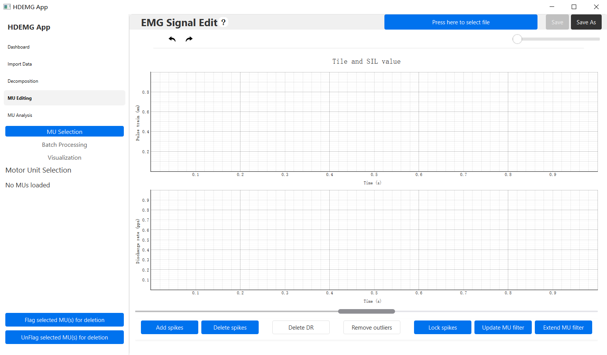

3. **Action:** Click the **Press here to select file** button.  
   **Expected Result:** A **Select File** dialog opens.
   - The MUEditing interface displays:  
   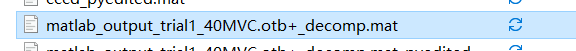

4. **Action:** In the `data` folder, select the file `matlab_output_trial1_40MVC.otb+_decomp.mat` and confirm.  
   **Expected Result:**  
   - The program begins loading the file.  
   - After a short delay, the **PulseTrain Plot** and **Discharge Rate Plot** show curves and red dots.  
   - The **Press here to select file** button text changes to the selected filename.
   - The MUEditing interface displays:  
   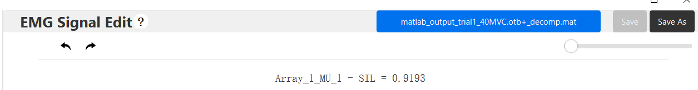

5. **Action:** Click the **Delete Spikes** button.  
   **Expected Result:**  
   - The **Delete Spikes** button turns green.  
   - All other action buttons turn grey and become disabled:

   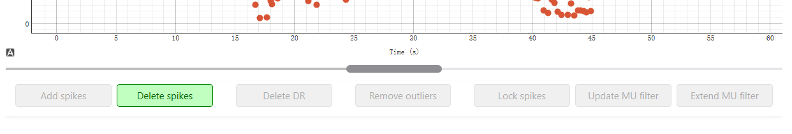

6. **Action:** Move the mouse pointer over the **PulseTrain Plot**.  
   **Expected Result:** The mouse cursor changes to a crosshair.

7. **Action:** Use click‑and‑drag (marquee) selection or single click to select red dots to delete.  
   **Expected Result:**  
   - Selected red dots are removed.  
   - The **Save** button in the top‑left corner becomes enabled and turns blue.

   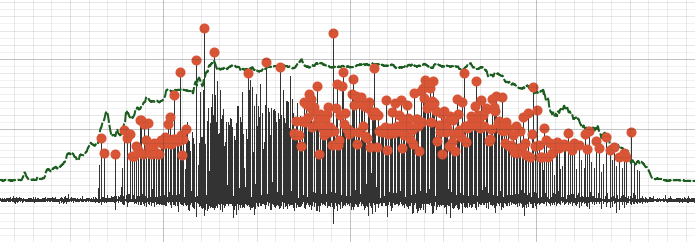

8. **Action:** Click the **Delete Spikes** button again.  
   **Expected Result:**  
   - The **Delete Spikes** button turns blue.  
   - All other action buttons turn blue and are re‑enabled.

   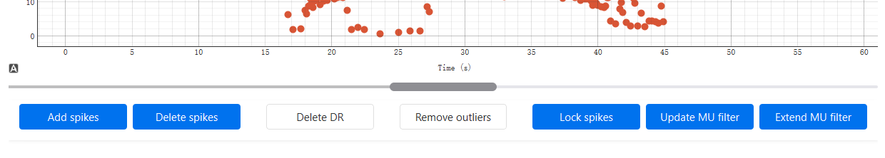

9. **Action:** Click the **Add Spikes** button.  
   **Expected Result:**  
   - The **Add Spikes** button turns green.  
   - All other action buttons turn grey and become disabled.

   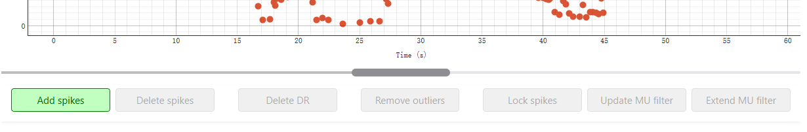

10. **Action:** Move the mouse pointer over the **PulseTrain Plot**.  
    **Expected Result:** The mouse cursor changes to a crosshair.

11. **Action:** Use click‑and‑drag (marquee) selection or single click to add spikes (red dots).  
    **Expected Result:** Selected spike positions are marked with red dots.

    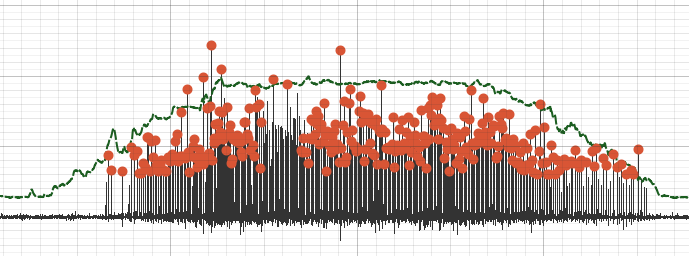

12. **Action:** Click the **Add Spikes** button again.  
    **Expected Result:**  
    - The **Add Spikes** button turns blue.  
    - All other action buttons turn blue and are re‑enabled.

     

13. **Action:** Click the **Save** button.  
    **Expected Result:**  
    - The **Save** button changes to an hourglass icon during save.  
    - After saving, the **Save** button turns grey and is disabled.  
    - The file selection button text updates to the newly created file:  
      `matlab_output_trial1_40MVC.otb+_decomp_pyedited.mat`  
    - The `data` folder contains the new file.

    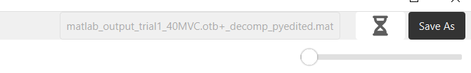
    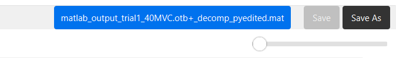
---

## Test Case 2 — Modify While Saving

### 📝 Preconditions
- Test Case 1 has been performed at least once.
- The application is in a state where the **Save** button is active (blue).

---

### 🔄 Test Steps & Expected Results

1. **Action:** Click the **Save** button.  
   **Expected Result:**  
   - The button changes to an hourglass icon.  
   - File save operation begins.

   

2. **Action:** While the save is in progress, continue modifying the data (e.g., adding or deleting spikes).  
   **Expected Result:**  
   - Modifications are accepted without error.  
   - Saving continues in the background.

   

3. **Action:** Wait for the save operation to complete.  
   **Expected Result:**  
   - The **Save** button returns to **blue and enabled** state (instead of grey/disabled).  
   - The latest modifications remain in the UI and can be saved again if required.

   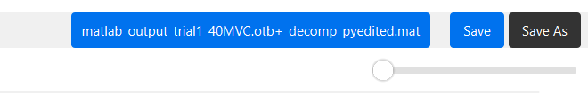
---

## Test Case 3 — Button State Change When Toggling ControlPanel Array1 MU2

### 📝 Preconditions
- The application is running with data already loaded (see Test Case 1 for initialization steps).
- Either the **Add Spikes** or **Delete Spikes** button is currently active (green).

---

### 🔄 Test Steps & Expected Results

1. **Action:** In the **ControlPanel**, click **Array1 MU2**.  
   **Expected Result:**  
   - All Action Buttons, **except** the **Remove Outlier** button, turn black and become disabled.  
   - The right‑side plot view switches to **multi‑MU view**, displaying the **PulseTrain** for both MUs.  
   - No button (other than **Remove Outlier**) responds to clicks while in this state.

   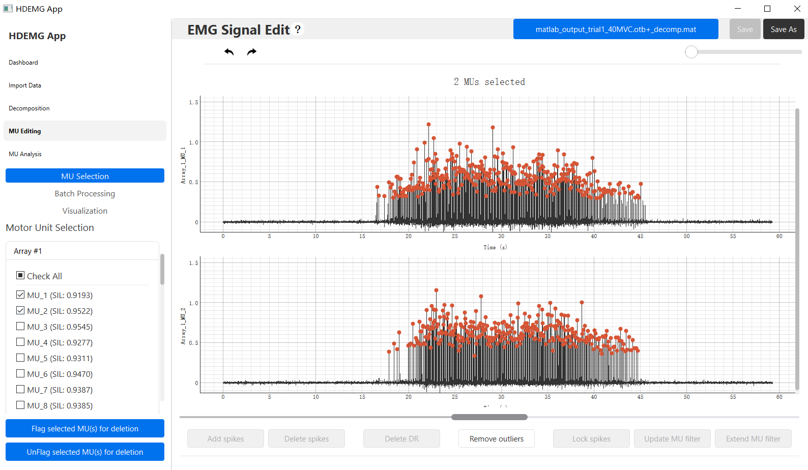

2. **Action:** Click **Array1 MU2** in the **ControlPanel** again.  
   **Expected Result:**  
   - All Action Buttons return to their normal enabled state (blue).  
   - The previously active mode (**Add Spikes** or **Delete Spikes**) is no longer active; all buttons are in their default state.
   
   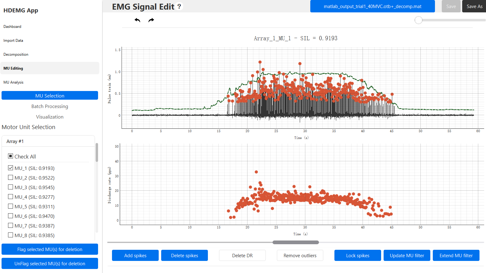
---

