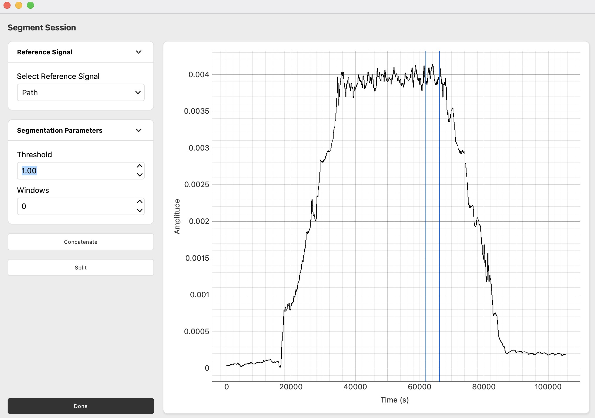
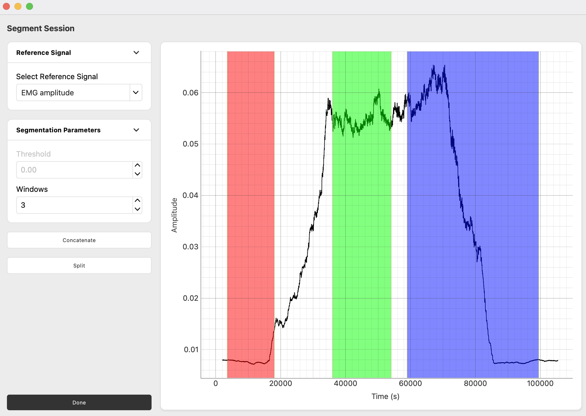
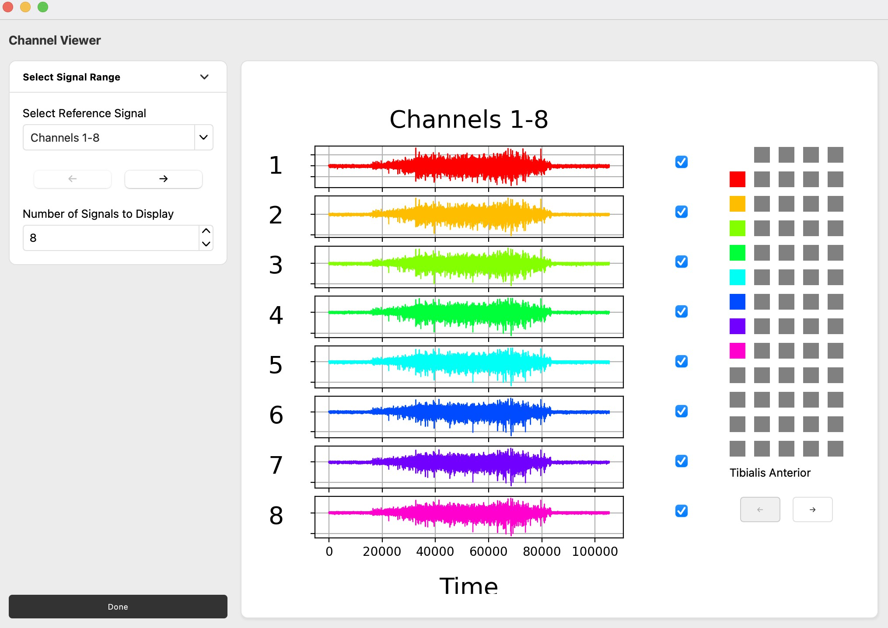

[](https://classroom.github.com/online_ide?assignment_repo_id=20546479&assignment_repo_type=AssignmentRepo)

# HDEMG Analysis Tool 🛑

⚠️ This project is a work in progress and should not be used for research until the first official release ⚠️

A Python-based application for High-Density Electromyography (HDEMG) signal analysis with motor unit decomposition, visualization, and editing capabilities.

Original matlab code the application is based off:
https://github.com/simonavrillon/MUedit
Drive containing data files used for testing:
https://drive.google.com/drive/folders/1nIpH1ksYWE-vQplEtilz843h2BuCuDmy


### Prerequisites

- Python 3.13+
- Pip 25.1+

### Quick Start Guide

#### The Easy Way [NO docker] (to be scripted)

1. Clone this repository:

   ```bash
   git clone git@github.com:modenaxe/pyMUEdit.git
   cd pyMUEdit
   ```

2. Ensure Python 3.13 or higher is installed

   ```bash
   python --version
   ```

3. Ensure Pip 25.1 or higher is installed

   ```bash
   pip --version
   ```

4. Create virtual environment

   ```bash
   python -m venv .venv
   ```

5. Activate the virtual environment

   ```bash
   Windows:
   .venv\Scripts\activate
   ```

   ```bash
   Linux/MacOS:
   source myenv/bin/activate
   ```

6. Install base requirements

   ```bash
   pip install -r requirements.txt
   ```

7. Install gpu requirements (ONLY if you have windows and nvidia gpu) - For cuda-enabled SCD

   ```bash
   pip install -r requirements-gpu.txt
   ```

8. Run the application:

   ```bash
   cd src
   python main.py
   ```
   
### Running MUedit Comparison Tests

We have some tests that pyMUEdit's results match those of MUedit, not all of which pass yet.

All of these tests require you to first install MATLAB (plus the Image Processing, Signal Processing, and Statistics and Machine Learning toolboxes), download MUedit, and add MUedit's `lib` folder to MATLAB's path.

#### Per-Function Tests

These tests make sure that individual functions in pyMUEdit behave the same as their equivalents in MUedit.

To run:

```sh
cd tests
/path/to/matlab -nodisplay -nosplash -nodesktop -r "run('gen_inputs.m'); exit()"
python testMUeditfunctions2.py
```

#### Result Tests

These tests (which do not yet pass) make sure that that the results of pyMUEdit, both intermediate and final, match those of MUedit.

To generate the results for comparison:

```sh
cd tests
/path/to/matlab -nodisplay -nosplash -nodesktop -r "run('gen_muedit_output.m'); exit()"
python ../src/run_decomposition.py --output-dir python_output trial1_20MVC.otb+
```

To compare the intermediate results:

```sh
cd tests
python testMUeditIntermediate.py
```

To compare the final results:

```sh
cd tests
python testMUeditOutput.py
```

### Manual Tesing Coverage
Due to the GUI-intensive nature of pyMUEdit and limitations in automated testing for pyQt5 applications, we have developed comprehensive manual system testing procedures. The following sections detail our testing methodology, coverage and execution steps.

**Complete Manual Testing Documentation:** [Manual_Testing_Documentation.pdf]capstone-project-25t3-3900-w14b-banana/Manual_Testing_Documentation.pdf

### Test Categories
Our manual testing suite covers the following areas:

1. **Import Data Tab Tests** - File loafing, configuration, segmentation and channel management
2. **Decomposition Tab Test** - Algorithm configuration, execution and result validation
3. **Manual Editing Tab Test** - Motor unit editing and quality control
4. **MU Analysis Tab Tests** - Force analysis, motor unit properties and visualisation.
5. **End-to-End Testing** - Exporting and loading sessions.

## Test Execution Requirements

**Prerequisites:**
- Python 3.13+ with all dependencies installed (`pip install -r requirements.txt`)
- Test data files available in `/data/` directory (e.g., `trial1_20MVC.otb+`)
- Application launched via `python src/main.py`

**Environment Setup:**

```bash
# Navigate to project directory
cd /path/to/capstone-project-25t3-3900-w14b-banana

# Activate virtual environment
source .venv/bin/activate  # Linux/macOS
# or
.venv\Scripts\activate     # Windows

# Run application
cd src
python [main.py](http://_vscodecontentref_/0)
```

## Application Features

### Importing Data
To begin, drag and drop or use the file selection UI to choose a `.otb+` or `.mat` file.\
The page will then display an aggregate graph of each electrode reading, each electrode being visible by using the left and right arrows.\
Importing a file also enables the **Set Configuration** (only on `.otb+` files), **Segment Session** (shortly after processing the file) and **Channel Viewer** buttons, which provide data modification, segmenting and viewing functionality respectively.

#### Set Configuration
Set Configuration contains a visualisation of the Quattrocento tool used for recording HDEMG signals. The left and right sidebars contain each of the inputs on the Quattrocento, displaying which are enabled or disabled which can be toggled with the checkboxes in the top left corner of each input box. The visualisation in the center provides a summary of which inputs are active (green when active, red when not) and responds to input changes. The following can be signal data can be modified:
- **Array type:** the electrode grid type used to collect the signal, which varies in arrangement and number of electrodes. If the selected array type does not correspond to the provided signal the decomposition will fail.
- **Muscle name:** a label used to indicate where a group of signals originate from, which can be helpful in correlating signal output to specific muscles.
- **Number of channels:** allows for the recorded number of channels to be specified if modification has occurred.

Click ‘Done’ when configuration is complete for changes to be applied to data.

#### Segment Session
Segment session provides the capability to inspect the imported EMG recording and either concatenate selected segments or split them into separate `.mat` files.
1. To begin, select the *auxiliary channel* you would like to display for segmentation.
2. Select a *segmentation method*:\
   a. **Automatic:** set a threshold to segment the session (two same-coloured lines mark the borders for each window)

   

   b. **Manual:** set the number of windows to select regions of interest (drag-and-drop and resize windows to determine ROIs)

   

3. Choose output option:\
   a. **Concatenate:** merge selected windows, deleting the data between selected regions.
   b. **Split:** save each selected window as a separate `.mat` file

Note: All segmented files will be populated in the **'Recent Files'** panel for easy access.


#### Channel Viewer
Channel Viewer provides an interactive interface for exploring and managing signal channels in the HD-EMG dataset.\
It provides you with the following features:
- **Channel Viewing:**
   - When opened, the panel displays all available channel signals in the uploaded EMG recording.
- **Channel Selection:**
   - Toggle the checkboxes next to each channel to either include or exclude channels from the decomposition process.
   - This can be used to remove channels with poor signal-to-noise ratio or to refine the decomposition target by selecting only relevant channels.
- **Adjustable Pagination:**
   - Control how many channel signals are displayed per page
- **Electrode Grid:**
   - Visualise all channels in their respective electrode grid configuration, providing the capability to navigate to particular channels via their grid config.





## Dockerized Application (CPU ONLY)

This application has been dockerized to allow for easy deployment and use on any system with Docker installed, eliminating the need to install dependencies locally. The application runs entirely inside the container and is accessed through your web browser or a VNC client. In the current state, you cannot utilise GPU if you choose to install with docker - This is due to the requirement of needing to pass through the GPU with WSL2 + nVidia Toolkit. This is possible to implement in the future if needed.
Therefore, do not use this method if you want to use Swarm Contrastive Decomposition with GPU.

#### Manual Setup

1. Clone this repository:

   ```bash
   git clone git@github.com:modenaxe/pyMUEdit.git
   cd pyMUEdit
   ```

2. Build and start the Docker container:

   ```bash
   # With Docker Compose (recommended)
   docker compose up -d

   # Or with Docker only (untested)
   docker build -t hdemg-analysis-tool .
   docker run -d --name hdemg-analysis-tool -p 5900:5900 -p 6080:6080 -v $(pwd)/data:/app/data hdemg-analysis-tool
   ```

4. Access the application:
   - **Web Browser**: Navigate to http://localhost:6080/vnc.html and click "Connect"
   - **VNC Client**: Connect to localhost:5900

### Accessing the Application

You have two options to access the application:

1. **Web Browser (Recommended)**:

   - Open http://localhost:6080/vnc.html in your web browser
   - Click the "Connect" button
   - No additional software needed

2. **VNC Client**:
   - Install any VNC client (like [RealVNC Viewer](https://www.realvnc.com/en/connect/download/viewer/))
   - Connect to `localhost:5900`
   - No password is required

### Persisting Data

The Docker setup mounts a `data` directory from your host machine to `/app/data` inside the container. Use this directory to store and access your HDEMG data files.

### Project Structure

```
pyMUEdit/
├── data/                  # Data directory mounted into the container
├── docs/                  # Documentation
├── src/                   # Source code
│   ├── app/               # Main application modules
│   │   ├── DecompositionApp.py
│   │   ├── DownloadConfirmation.py
│   │   ├── ExportConfirm.py
│   │   ├── ExportResults.py
│   │   ├── HDEMGDashboard.py
│   │   ├── ImportDataWindow.py
│   │   └── MUeditManual.py
│   ├── core/              # Core functionality
│   ├── public/            # Static resources
│   ├── ui/                # UI components
│   ├── workers/           # Background worker threads
│   └── main.py            # Main entry point
├── docker-compose.yml     # Docker Compose configuration
├── Dockerfile             # Docker container definition
├── requirements.txt       # Python dependencies
├── run-hdemg.bat          # Windows run script
├── run-hdemg.sh           # Linux/macOS run script
└── supervisord.conf       # Supervisor configuration
```

### Stopping the Application

- **With Docker Compose**:

  ```bash
  docker compose down
  ```

- **With Docker only**:
  ```bash
  docker stop hdemg-analysis-tool
  docker rm hdemg-analysis-tool
  ```

### Application Features

- Import and analyze HDEMG data
- Decompose EMG signals into motor units
- Edit motor units manually
- Visualize signal patterns
- Export analysis results

---

### Supported Input Formats  

* `.otb+` (OT BioLab +)  
* `.rhd` (Intan RHX “one file per channel”)  
* `.mat` / `.csv`

> **Minimum array sizes** — at least **32 surface** *or* **16 intramuscular** electrodes are required.

### Session Segmentation  

1. Click **Segment Session**.  
2. Choose an auxiliary channel or **EMG amplitude**.  
3. Enter a **threshold** *or* specify **number of windows** and drag-select them.  
4. Click **Concatenate** (merge) or **Split** (each window to its own `.mat`).

---

### Decomposition Parameters  

| Setting | Purpose |
|---------|---------|
| **Reference** | Auto segmentation on `Target`, or manual on any trace. |
| **Check EMG** | “Yes” opens per-column QC to discard noisy channels. |
| **Contrast** | `logcosh`, `skew`, `kurtosis`. |
| **Initialisation** | `EMG max` (deterministic) or `Random`. |
| **CoV filter** | Keep units with ISI-CoV below threshold. |
| **Peel-off** | Subtract accepted unit before next iteration. |
| **Refine MUs** | Automatic outlier removal & filter update. |
| **Iterations** | FastICA iterations per grid & window. |
| **Windows** | Number of ROIs. |
| **Threshold target** | Fraction (0-1) of target force. |
| **Extended channels** | Size after time-delay embedding. |
| **Duplicate thr.** | Overlap % to tag duplicates (default 0.30). |
| **SIL / CoV thresholds** | Quality cut-offs. |

---

### Running Decomposition  

1. Perform channel QC if **Check EMG = Yes**.  
2. Select ROIs if manual segmentation.  
3. Progress bar reports `Grid`, `Iteration`, `SIL`, `CoV`.  
4. Output `*_output_decomp.mat` contains  

| Variable | Content |
|----------|---------|
| `signal.Pulsetrain` | Cell (units × time) per grid |
| `signal.Dischargetimes` | 2-D cell `[grid, unit]` |

---

## Manual Editing  

For the manual editing section, we provide detailed instructions for users: 
[MU_editing_user_guide.pdf](./docs/analysis_tab-documentation.pdf)

### ShortCuts

| Action | Key | Effect |
|--------|-----|--------|
| Flag unit(s) | — | Mark unreliable trains |
| Remove outliers | **r** | Delete spikes causing extreme ISI |
| Add spikes | **a** | Toggle mode to enable Click / Box-select addition of missed spikes |
| Delete spikes | **d** | Toggle mode to enable Click / Box-select deletion of false positives |
| Delete Discharge Rate (dr) | **S** | Toggle mode to enable Click / Box-select deletion of false positives |
| Update filter | **Space** | Re-estimate separation vector (current window) |
| Extend filter | **e** | Slide window (50 % overlap) across recording |
| Lock spikes | **l** | Freeze current spikes before re-evaluation |
| Undo / Redo | **z** / **x** | Unlimited stack |
| Save | **Ctrl+S** | Quick save files |
| Undo / Redo | **z** / **x** | Unlimited stack |
| Scroll Left / Right | **ArrowLeft** / **ArrowRight** | Scroll the plot view horizontally |
| Zoom In / Out | **ArrowUp** / **ArrowDown** | Zoom in or out on the plot view |
| Exit mode | **numpad 0** / **Esc** | Exit editing mode |

*Marker colours* — green (+SIL), blue, orange, red (–SIL).

Batch buttons: **Remove all outliers**, **Update all MU filters**, **Remove Duplicate within grids**, **Remove Duplicate between grids**.  
**Save** → `*_pyedited.mat` containing an `edition` structure (edited pulse trains & discharge times).

---

### Duplicate Check & Visualisation  

*Duplicates* — spikes aligned within ±0.5 ms; overlap ≥ `Duplicate thr.`.  
Buttons: **Remove duplicates within grid** / **across grids**.

*Visualisation* tab  
* **Plot MU spike trains** — raster per grid


* **Plot MU firing rates** — 1 s Hanning-smoothed rate


---

## Algorithmic Detail (advanced users)  

> For those who wish to extend or audit the pipeline.

```
import  → grid/muscle  → segment  → channel QC
     ↓                   ↓
filter (notch + BP)  →  extend + whiten
     ↓
FastICA (fixed_point_alg)
     ↓
K-means spike/noise  ↻  refine (min_cov_isi)
     ↓
SIL assessment  →  accept & peel-off  →  repeat until done
```

*Built with:* Python 3 · NumPy · SciPy · scikit-learn · Matplotlib/PyQtGraph · PyQt5

---

### Troubleshooting

If you encounter issues:

1. **Application doesn't appear in the browser**:

   - Make sure ports 5900 and 6080 aren't being used by other applications
   - Try running `docker logs hdemg-analysis-tool` to see if there are any error messages

2. **Application is slow**:

   - Increase the memory allocated to Docker in Docker Desktop settings
   - You can adjust screen resolution in the supervisord.conf file if needed

3. **Data files not visible in the application**:

   - Make sure you're placing your files in the `data` directory of your project
   - Check that the volume mount is working with `docker inspect hdemg-analysis-tool`

4. **Python module not found errors**:
   - If you encounter missing module errors, you may need to add them to requirements.txt
   - Rebuild the Docker image after updating: `docker-compose build` or `docker build -t hdemg-analysis-tool .`

--- 

## Analysis Tab Documentation
The analysis tab aims to replicate features from the openHDEMG application [https://www.giacomovalli.com/openhdemg/]

Documentation for the implemeneted features can be found in [analysis_tab-documentation.pdf](./docs/analysis_tab-documentation.pdf)

*Note - currently the file upload function does not support output files from the decomposition and edit tabs, for testing purposes, please use [otb_testfile.mat]

### Contributors

UNSW Capstone 2025 teams:

- Team 25t1: W16A-CELERY (app prototype)
- Teams 25t2:
  - T11A-BANANA (import and decomposition tab)
  - T09A-ALMOND (manual decomposition tab)
  - W18A-BANANA (analysis tab)