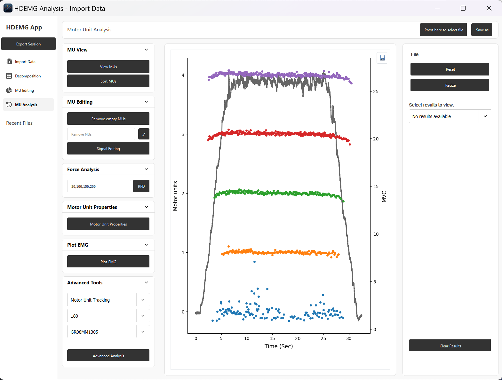

# W14BBANANA - MU Analysis Tab Documentation

This document provides documentation of the Analysis tab. This tab replicates the functions provided by openHDEMG. For more detailed explanation of each function, please refer to the associated documentation <https://www.giacomovalli.com/openhdemg/gui_basics/>

## Overview

The layout of this tab was designed to replicate that of openHDEMG. Seasoned users of openHDEMG should find this layout familiar.

### File select and Save as

- Load the file to analyse. Currently only supports openHDEMG JSON, or .mat files matching the layout of otb_testfile.mat. Please note the current outputs of the other tabs in this application are not yet compatible with this tab due to file structure differences.
- Save as: exports results in current selection as CSV

### Reset and Resize file

- Reset: Reloads the file (reset and undo all analysis changes made in the current session)
- Resize: Launches popout to select an area of the EMG file. Resizes the EMG file to the selected area. <https://www.giacomovalli.com/openhdemg/gui_basics/#resize-emg-file>

### Results section

- Results Tab Drop Down: selects historical results to display and export, shows latest results at the top of the list
- Clear Results: clears all existing results, once results are cleared they cannot be recovered

## MU View

- View MUs: if a secondary plot i.e. refsig is being displayed, will show the primary MU plot
- Sort MU: sorts the MUs <https://www.giacomovalli.com/openhdemg/gui_basics/#motor-unit-sorting>

## Signal Editing

Relevant openHDEMG documentation: <https://www.giacomovalli.com/openhdemg/gui_basics/#emg-signal-filtering>

Inside signal editing, there are 5 buttons the user can interact with, each button requiring the user to first fill out the text inputs in the same row. Note, all text inputs are pre-filled with default inputs. Here is an explanation of all 5 buttons:

- Filter EMG signal: Filters the EMG signal based on the filter order and BandPass Frequency and plots the result in the centre of the screen. Note, this can often look very similar to the original plot that appears in the centre when you first load a file
- A BandPass Frequency of 20-500 filters out everything outside the range 20hz-500hz
- Filter Refsig: Low-pass filters the reference signal and removes noise based on the filter order and cutoff frequency
- A Cutoff Frequency of 15hz filters out signals equal to and greater than 15
- Remove offset: Removes the reference signal offset and shifts the range
  - If the automatic offset is less than or equal to 0:
    - If the offset value is non-zero:
      - The offset is removed based on the offset value (e.g., an offset value of 4 will result in an offset correction by -4 in y-axis direction)
    - If the offset value is 0:
      - A prompt appears, asking the user to manually select an area, after which the offset value is computed based on the selected area
  - If the automatic offset is greater than 0:
    - The offset is automatically removed based on the number of samples passed in input
- Convert: The reference signal is multiplied/divided by the factor specified in the operator and factor text boxes respectively
- To Percent: Converts the MVC value to a percentage and divides the reference signal by the percentage

## Advanced tools

Please refer to the openHDEMG documentation for functions in this section: <https://www.giacomovalli.com/openhdemg/gui_advanced/>

### Motor Unit Tracking

Calls the openHDEMG GUI to perform this function. Please refer to the openHDEMG documentation for this feature. <https://www.giacomovalli.com/openhdemg/gui_advanced/#motor-unit-tracking>

### Persistent Inward Currents

Computes PIC based on parameters. Please refer to the openHDEMG documentation for this feature. <https://www.giacomovalli.com/openhdemg/gui_advanced/#persistent-inward-currents>

### Conduction Velocity

Please refer to the openHDEMG documentation for this feature. <https://www.giacomovalli.com/openhdemg/gui_advanced/#conduction-velocity>
